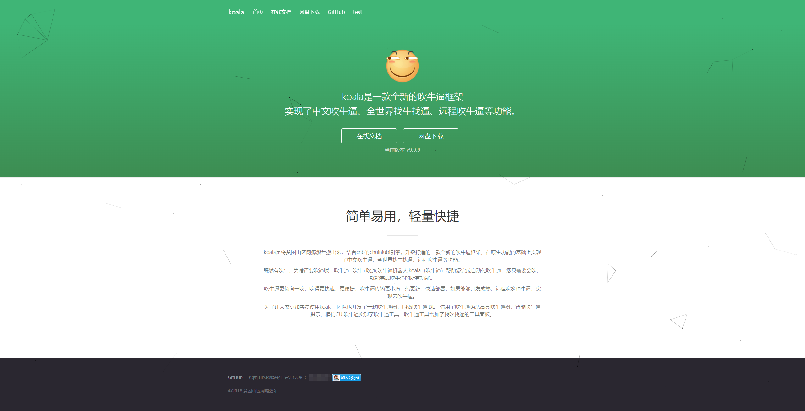

# 基于python的flask框架的官网，软件发布页！

## 只用pip安装两个库 flask_sqlalchemy ,flask。

## 移动端页面兼容


## 项目启动

部署简单教程

拉取镜像（已公开在阿里云镜像中心）
```
docker pull registry.cn-shenzhen.aliyuncs.com/koala9527/koala9527-flask-website:latest
```
运行容器
```
docker run --name flask-website -id -p 5000:5000 registry.cn-shenzhen.aliyuncs.com/koala9527/koala9527-flask-website:latest
```
## 访问：127.0.0.1:5000 效果：
  




